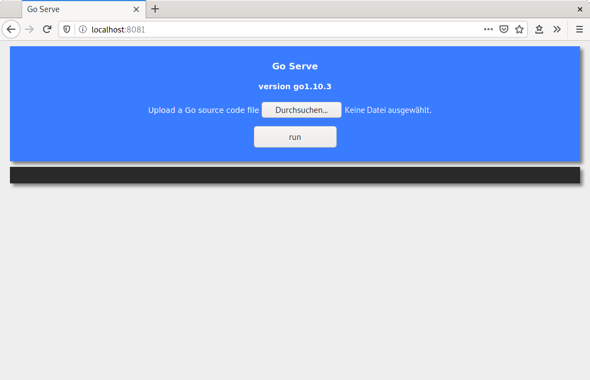
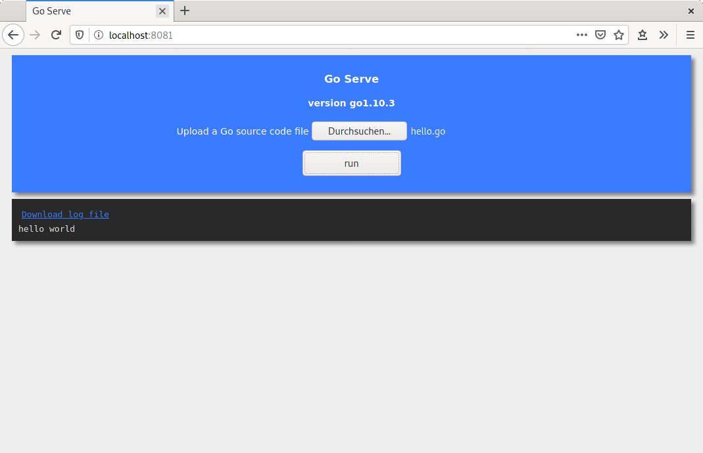

go-serve
=========

Simple Web UI to upload and excute Go code. Select a source code file on your
machine and get the output in return.

> **CAUTION!** This is a simple fun project and should not be used in production!

# Build

Simply run `make all` will build the project. *go-serve* requires `gorilla/mux`. Which will be
installed during the build. The last step creates a docker image. This can be run with

# Run

```sh
$ docker run --name go-serve -d -p 8081:8081 go-serve:1.0.0
```

The web UI will be available at `localhost:8081`



Select a go file to upload and execute it. The output will be printed on the screen and a log file
will be available for download.


